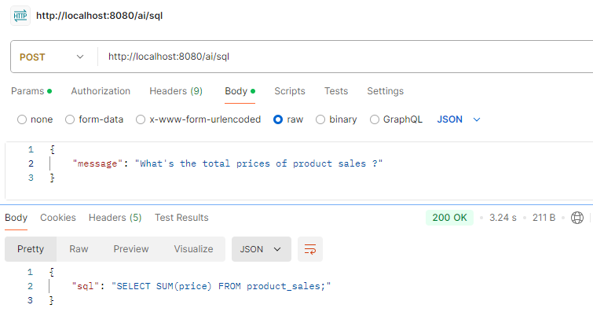
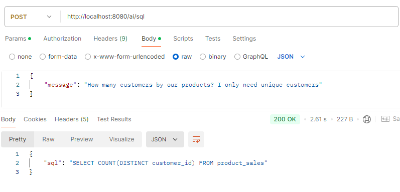
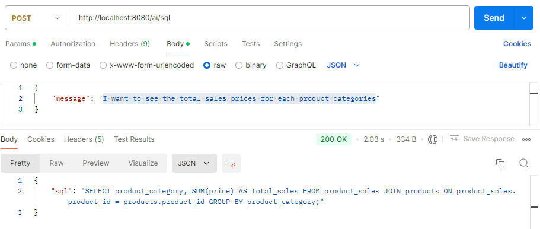
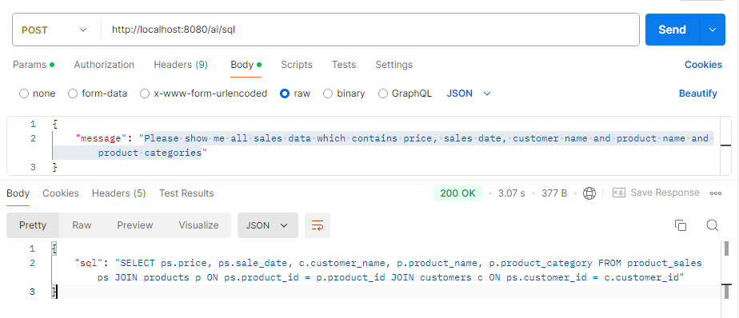
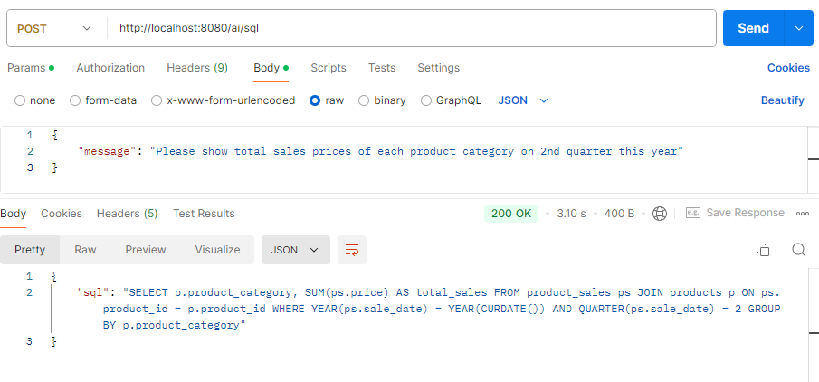

# Intelligent SQL Generator - Generative AI Application
This project is generative AI application example, it is using Spring AI components and AWS Bedrock to dynamic generate the SQL base on user natural language.

# Before Run
In `application.properties`, there are `AWS_ACCESS_KEY_ID` and `AWS_SECRET_ACCESS_KEY` of AWS credentials configuration. Config with your AWS credentials in
JVM environments or System environments before run application.

For the `AWS Bedrock`, make sure you're trying to using same `Anthropic` `Claude` AI model, the model ID should be available in
your AWS account region. You can update the AWS region and AI model id in `application.properties` like below

```properties
spring.ai.bedrock.aws.region=<your aws region>
spring.ai.bedrock.anthropic3.chat.model=<your anthropic3 model id>
```

Java version is `JDK 17`.

# Run
Execute below command to compile jar package

``` shell
./mvnw clean install
```

After the jar package compiled under `/target` folder. run below command lunch server. The server default port is 8080.

```shell
java -jar .\target\spring-ai-datasql-0.0.1-SNAPSHOT.jar
```

# Demo
### Example 1
**Input:**

```
What's the total prices of product sales ?
```

**Output:**

The response will be like below.

``` sql
  SELECT SUM(price) FROM product_sales;
```

**Postman Screenshot:**



The `AI` model can generate the SQL text base on user input message.

### Example 2
**Input:**

```
How many customers by our products? I only need unique customers.
```

**Output:**

``` sql
SELECT COUNT(DISTINCT customer_id) FROM product_sales
```

**Postman Screenshot:**



### Example 3
**Input:**

```
I want to see the total sales prices for each product categories.
```

**Output:**

``` sql
SELECT product_category, SUM(price) AS total_sales FROM product_sales JOIN products ON product_sales.product_id = products.product_id GROUP BY product_category;
```

**Postman Screenshot:**


### Example 4
**Input:**

```
Please show me all sales data which contains price, sales date, customer name and product name and product categories
```

**Output:**

``` sql
SELECT ps.price, ps.sale_date, c.customer_name, p.product_name, p.product_category FROM product_sales ps JOIN products p ON ps.product_id = p.product_id JOIN customers c ON ps.customer_id = c.customer_id
```

**Postman Screenshot:**



### Example 5
**Input:**

```
Please show total sales prices of each product category on 2nd quarter this year
```

**Output:**

``` sql
SELECT p.product_category, SUM(ps.price) AS total_sales FROM product_sales ps JOIN products p ON ps.product_id = p.product_id WHERE YEAR(ps.sale_date) = YEAR(CURDATE()) AND QUARTER(ps.sale_date) = 2 GROUP BY p.product_category
```

**Postman Screenshot:**


